# Manual del Administrador
### Sistema de Seguimiento de Prospectos

Esta guía explica, módulo por módulo, **qué problema resuelve** y **cómo le ayuda** al dueño/administrador a vender más y controlar la operación con menos esfuerzo.

---

## 1. Acceso al sistema

Ingrese la URL del sistema, escriba su **usuario** y **contraseña** y presione **Iniciar sesión**.

> **Seguridad:** el usuario inicial trae una clave por defecto. En el primer ingreso cree su usuario real (sección 5) y cambie/desactive el de fábrica.

---

## 2. Tablero — su operación de un vistazo

**El problema:** sin un panel central, el dueño no sabe cómo va el día hasta que pide reportes.
**Cómo le ayuda:** apenas entra, ve el estado completo y dónde actuar.

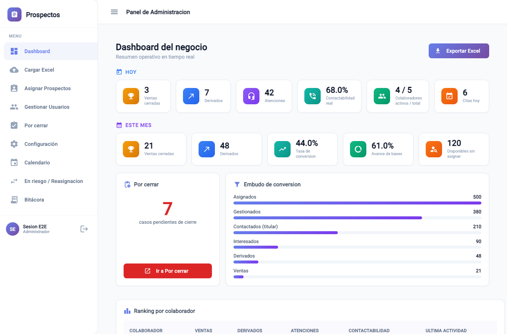

- **Hoy / Mes:** ventas cerradas, derivados, atenciones, contactabilidad real, conversión, % de avance de bases.
- **Ranking por colaborador:** quién rinde y quién necesita apoyo.
- **Embudo:** dónde se cae el proceso (asignados → contactados → interesados → derivados → ventas).
- **Por cerrar:** cuántas ventas dependen de usted ahora mismo.
- **Asistencia de hoy:** quién está presente/ausente (solo días laborables, tras la hora + tolerancia).
- **Casos "En riesgo":** prospectos de ausentes que hay que reasignar para no perderlos (la tarjeta lleva directo a Reasignación).

---

## 3. Cargar una base (Excel)

**El problema:** cargar prospectos uno por uno es inviable.
**Cómo le ayuda:** sube cientos de prospectos en segundos y ve qué entró y qué se rechazó (con el motivo).

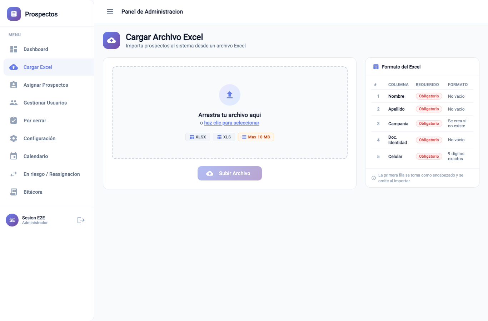

Columnas del archivo, en orden: **nombre, apellido, campaña, documento, celular** (la primera fila es el encabezado). Cada archivo cargado es una **base** lista para repartir.

---

## 4. Asignar prospectos a los colaboradores

**El problema:** repartir trabajo "a ojo" genera desbalance y prospectos sin dueño.
**Cómo le ayuda:** reparte por **cantidad exacta** entre varios colaboradores en un solo flujo, con saldo visible y **auditoría** de quién asignó y cuándo.

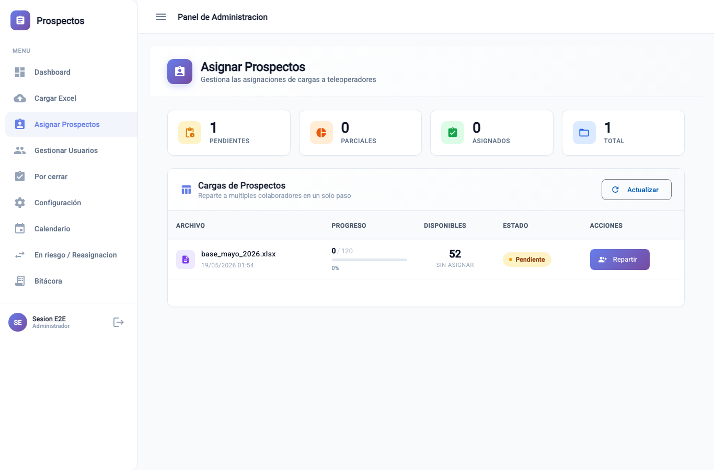

---

## 5. Gestión de usuarios

**El problema:** controlar accesos y datos de cada colaborador.
**Cómo le ayuda:** crea, edita o desactiva usuarios con rol (ADMINISTRADOR / TELEOPERADOR). Desactivar no borra el historial.

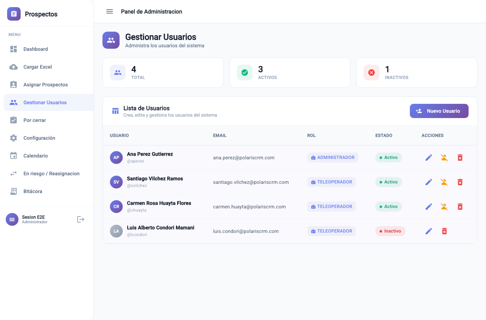

En la edición de un colaborador puede además **subir su Tarjeta de WhatsApp** (su imagen de presentación con nombre y teléfono). Esa tarjeta es la que el colaborador adjunta al contactar por WhatsApp (ver sección 10) — así cada asesor envía su propia firma profesional.

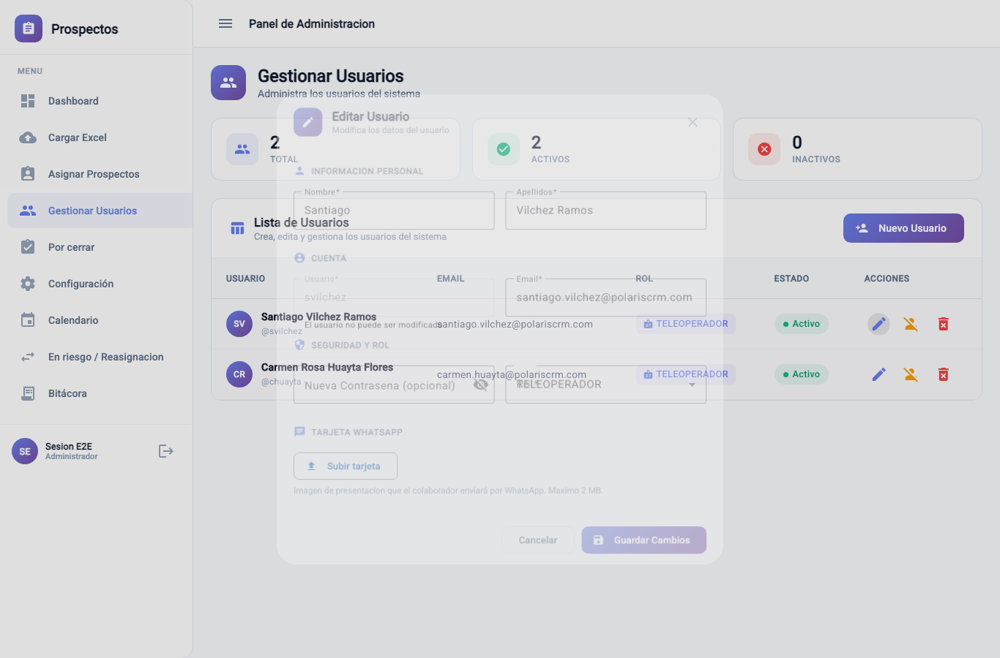

---

## 6. Configuración — el sistema trabaja a su medida

**El problema:** cada operación tiene reglas distintas (plazos, intentos, horarios, mensajes).
**Cómo le ayuda:** define las reglas una vez y el sistema las aplica solo, sin depender de la memoria de nadie.

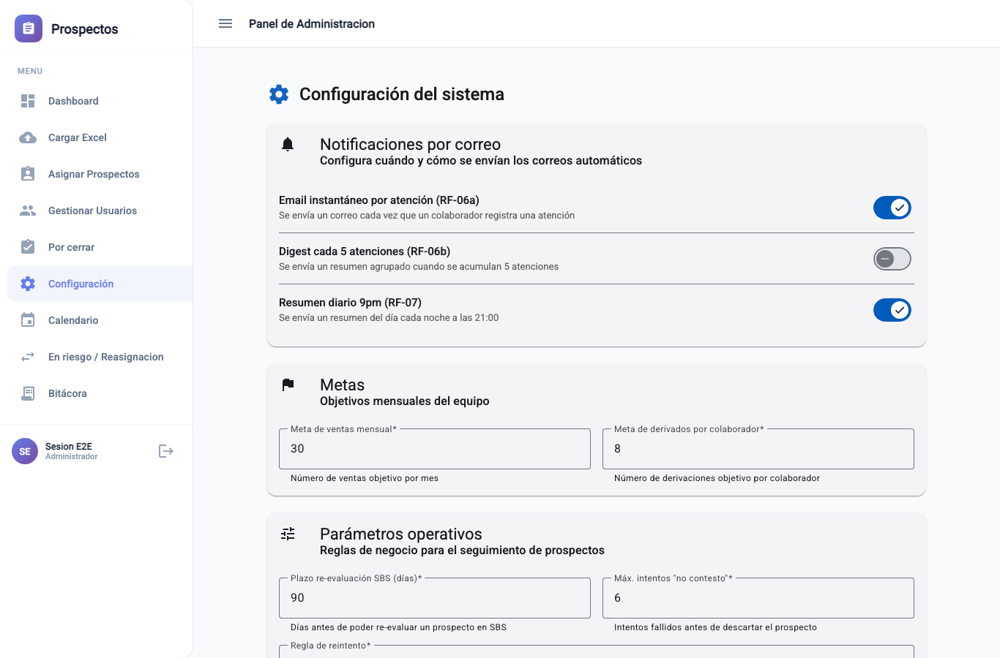

- **Correos al dueño:** *instantáneo* (cada atención), *resumen cada 5* y *resumen diario 9 pm* con Excel adjunto. **Le ayuda a estar al tanto sin entrar al sistema.**
- **Días de seguimiento de "Interesado":** cuántos días hábiles después se recontacta a un interesado (evita que el lead se enfríe — ver Manual del Colaborador).
- **Plantilla de WhatsApp:** el texto del mensaje que envían los colaboradores (variables `{nombre}` del prospecto y `{asesor}`). **Le ayuda a mantener un discurso comercial uniforme y cumplir el guion del convenio.**
- **SBS:** plazo de reevaluación de observados.
- **Reintentos "No contestó":** máximo de intentos y regla escalonada (ej. +3 h, +24 h, +48 h…).
- **Jornada:** hora de inicio esperada y minutos de tolerancia antes de marcar ausencia.
- **Metas:** ventas mensuales y derivados por colaborador.

> El correo solo se envía si la cuenta de envío está configurada; si no, el sistema funciona igual y el envío se "salta" dejando registro.

---

## 7. Calendario laboral

**El problema:** agendar o marcar ausencias en feriados/domingos distorsiona todo.
**Cómo le ayuda:** feriados de Perú precargados y editables; el sistema **no agenda ni marca ausencia** en días no laborables.

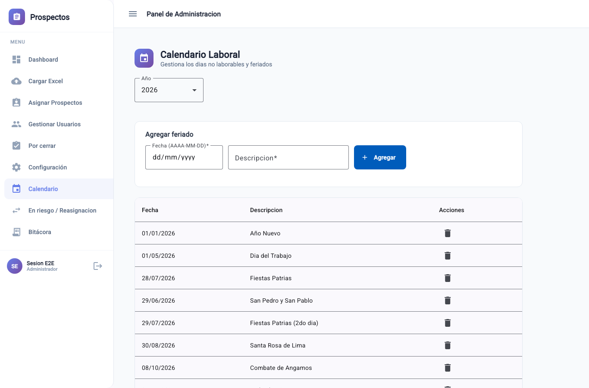

---

## 8. Reasignación y casos "En riesgo"

**El problema:** si un colaborador falta, sus prospectos del día se enfrían y se pierden ventas.
**Cómo le ayuda:** los casos activos de un ausente quedan **"En riesgo"** y usted los reasigna (todo o lo que elija) a otro colaborador, conservando el historial y con auditoría. La venta futura se sigue atribuyendo a quien corresponde.

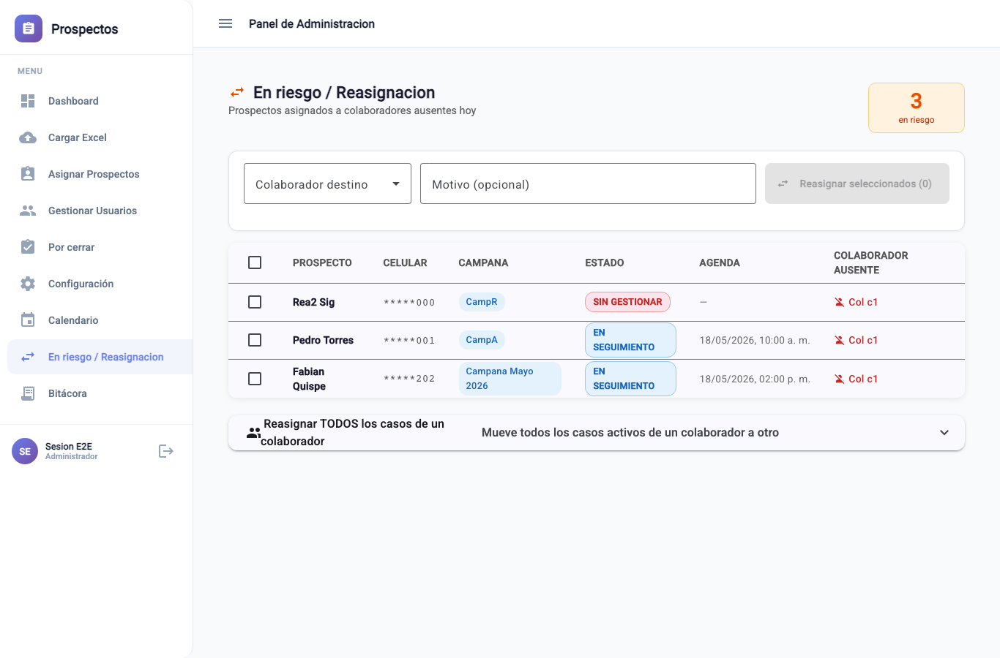

---

## 9. Bitácora global

**El problema:** auditar "qué pasó con tal cliente" o "qué se hizo hoy" sin una vista central.
**Cómo le ayuda:** todas las atenciones de todos, con **filtros** (fechas, colaborador, campaña, base, resultado, quién contestó) y **export a Excel**. Ideal para control y auditoría.

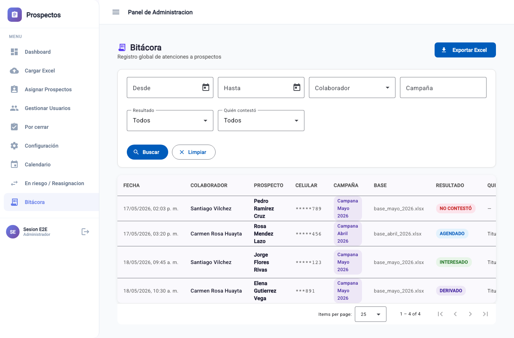

---

## 10. Cerrar ventas (Por cerrar)

**El problema:** la venta no la cierra el colaborador; necesita un punto de control del dueño.
**Cómo le ayuda:** cuando el colaborador marca **Derivar (ACEPTÓ)**, el caso llega aquí para que **usted cierre la venta**.

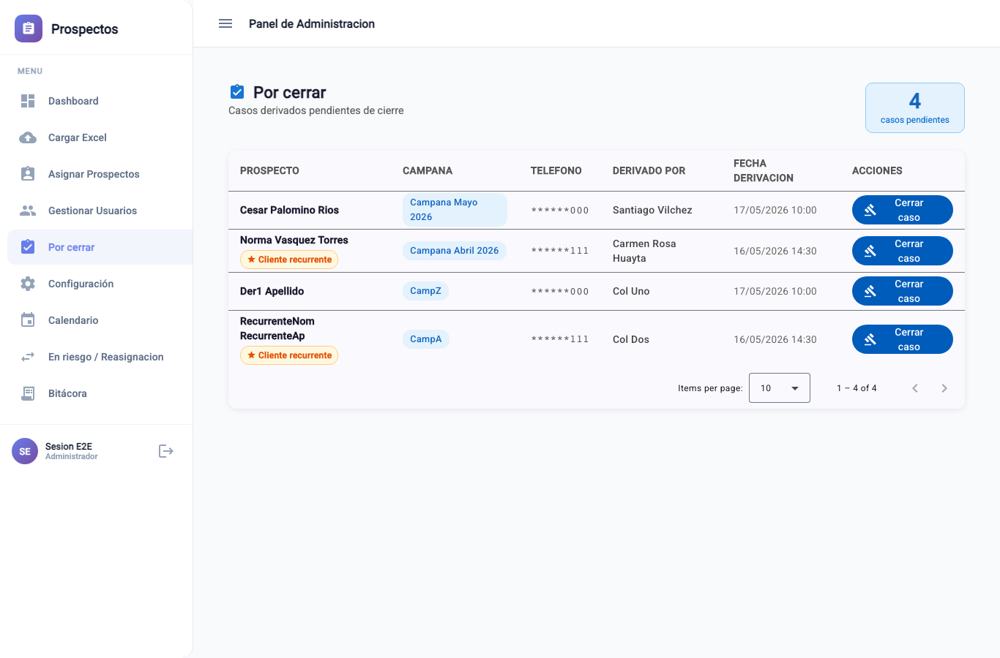

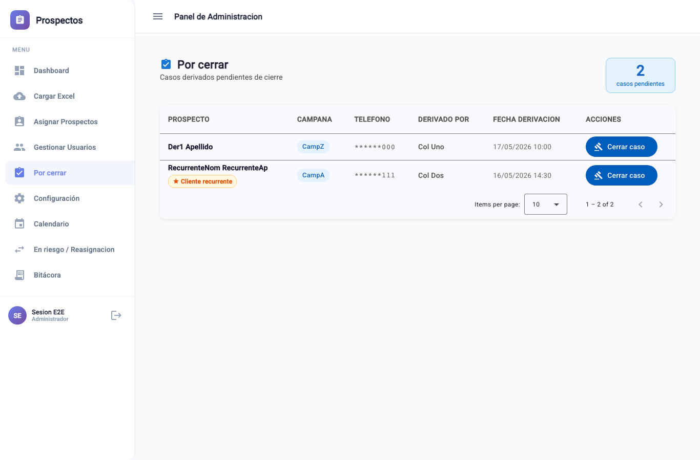

- **Registrar venta:** marca **GANADO** (venta concretada), atribuida al colaborador que derivó.
- **No cerró:** **reintentar** (vuelve a seguimiento con fecha futura) o **descartar**.

Un cliente GANADO puede volver a ser elegible más adelante; el sistema genera un nuevo ciclo automáticamente sin tocar el histórico.

---

## 11. Novedades que le ahorran trabajo

- **Correo automático del dueño** (resumen 9 pm + avisos): visibilidad sin entrar al sistema; un solo correo aunque haya varios servidores.
- **WhatsApp con plantilla y tarjeta por asesor:** mensaje comercial uniforme y firma profesional de cada colaborador, configurados por usted.
- **"Interesado" ya no se pierde:** queda agendado con fecha de seguimiento automática (usted define los días).
- **Asistencia y horarios automáticos** (hora de Perú): jornada y ausencias sin trámite manual.

---

## 12. Recomendaciones

- Cambie la clave por defecto y cree usuarios nominales.
- Revise el **dashboard** a diario (asistencia, "En riesgo", "Por cerrar").
- Ajuste **Configuración** (plantilla WhatsApp, plazos, metas) según resultados.
- Suba la **tarjeta de WhatsApp** de cada colaborador para que puedan usar el envío.

---

*Fin del Manual del Administrador.*
