# Manual del Colaborador (Teleoperador)
### Sistema de Seguimiento de Prospectos

Esta guía explica cómo el sistema le ayuda a **no perder clientes** y **vender más**, paso por paso, con el "para qué" de cada función.

---

## 1. Acceso — y su jornada se inicia sola

Ingrese con su **usuario** y **contraseña**.

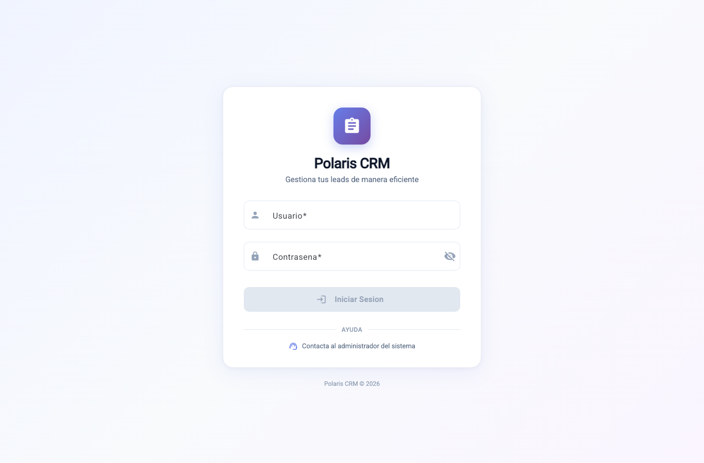

**Cómo le ayuda:** al **primer ingreso del día su jornada se registra automáticamente**. No tiene que marcar entrada a mano y su asistencia queda registrada para el dueño. Las horas que verá (cronómetro, agendas) están en hora de Perú.

---

## 2. Su cola de prospectos

**El problema:** sin orden, los prospectos urgentes se mezclan con el resto.
**Cómo le ayuda:** ve solo lo suyo, con los **vencidos resaltados** y filtros ("para hoy", agendados, sin gestionar…). Verá el **DNI y el teléfono completos** de sus prospectos — los necesita para consultar SBS y para llamar.

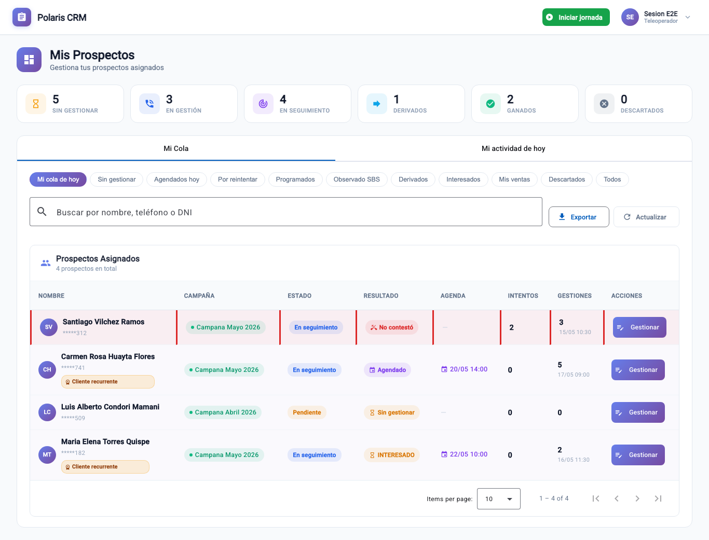

---

## 3. Atención al Prospecto (registro guiado)

Al abrir un prospecto arranca un **cronómetro** (mide su tiempo de gestión) y ve el **historial** de contactos previos, para no repetir lo ya dicho.

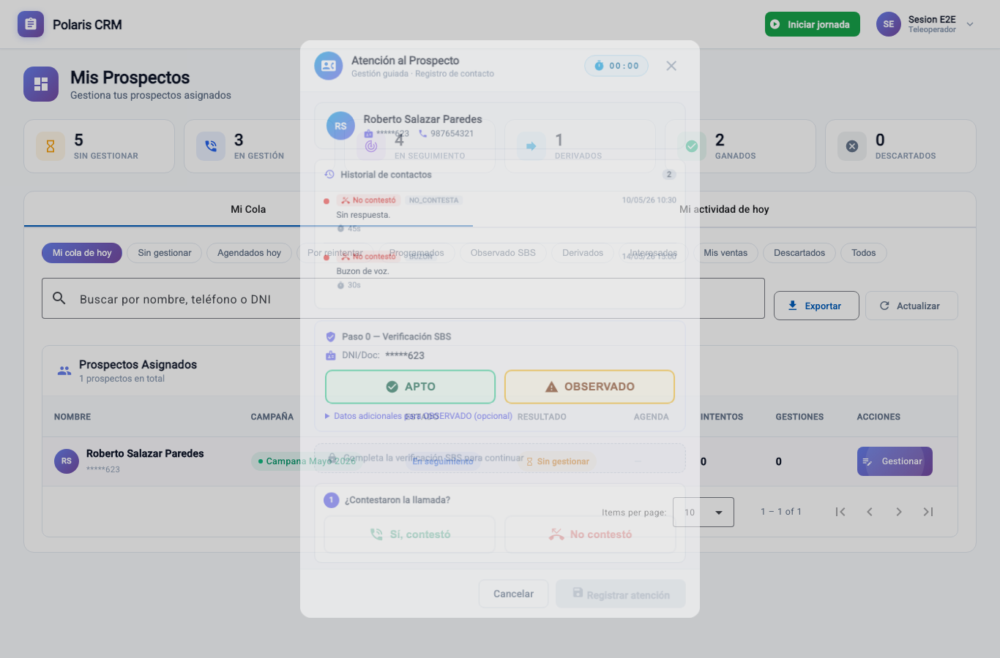

El registro es **guiado**: el sistema le indica el siguiente paso y no deja saltarse ninguno (así no se pierde información).

### Paso 0 — Verificación SBS (obligatorio)

Consulte el documento del cliente en SBS y marque el resultado:

- **APTO:** continúa el flujo.

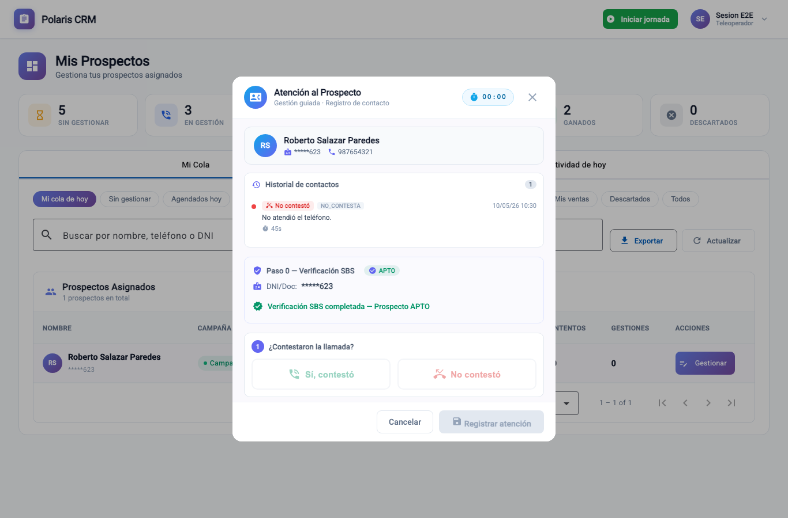

- **OBSERVADO:** el cliente no es apto ahora; el sistema lo **reprograma solo** para una reevaluación futura y cierra el modal.

### Paso 1 — ¿Contestaron?

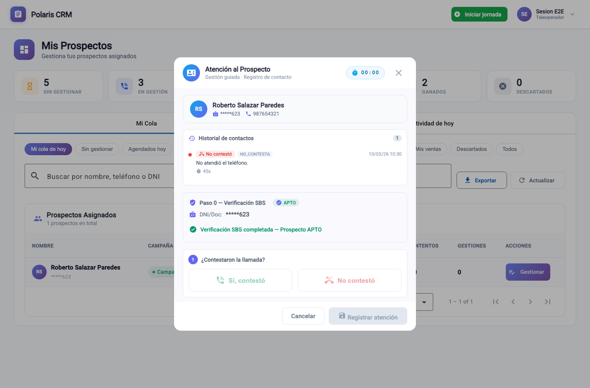

- **No contestó:** elija el submotivo. El sistema **propone solo** la próxima fecha/hora de llamada (usted puede editarla). Si se superan los intentos máximos, se descarta como ilocalizable. **Le ayuda:** no tiene que llevar la cuenta de reintentos.
- **Sí, contestó:** continúe.

### Paso 2 — ¿Quién contestó?

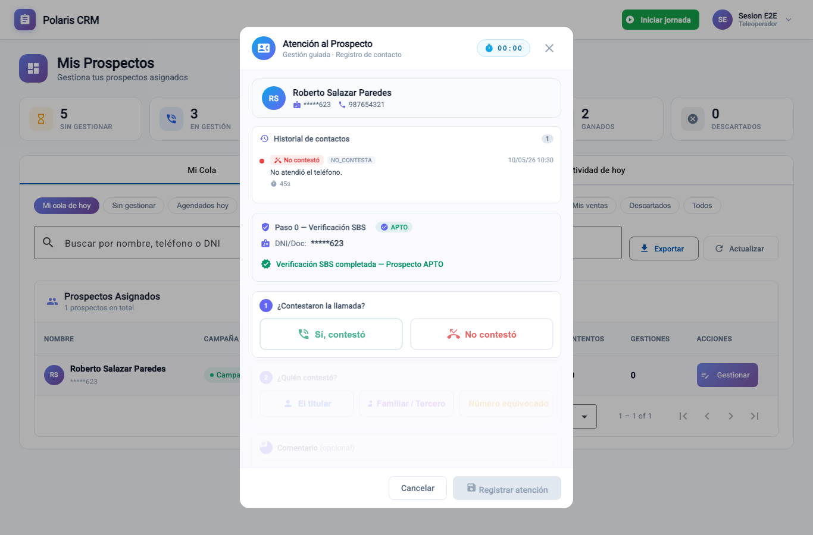

Titular / Tercero / Equivocado.

### Paso 3 — Resultado de la conversación

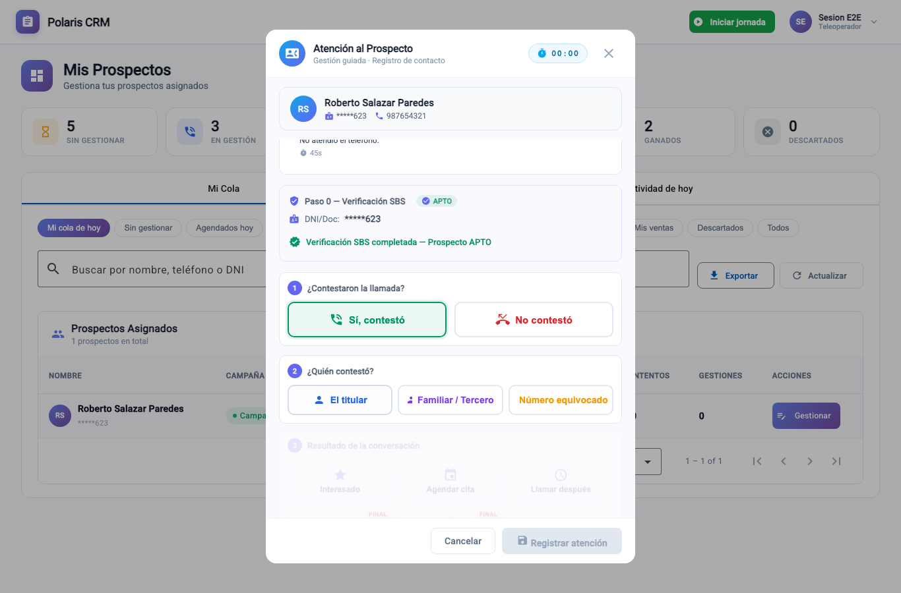

| Opción | Qué hace y cómo le ayuda |
|---|---|
| **Interesado** | Programa un **seguimiento** para no perder al cliente (ver punto 4). |
| **Agendar cita** | Cita con fecha/hora; queda en seguimiento. |
| **Llamar después** | Recontacto con fecha/hora. |
| **Derivar (ACEPTÓ)** | El cliente aceptó: pasa al dueño para cerrar la venta. La venta se le atribuye a usted. |
| **No volver a llamar** | Cierre negativo. |

> Usted no marca la venta: cuando el cliente acepta usa **Derivar (ACEPTÓ)** y el dueño la concreta. Igual la venta queda a su nombre.

---

## 4. "Interesado": el cliente ya no se pierde

**El problema:** antes, un "interesado" sin fecha quedaba en el aire y se enfriaba.
**Cómo le ayuda:** al marcar **Interesado**, el sistema **agenda automáticamente un seguimiento** con una fecha sugerida (editable). El caso vuelve a su cola en esa fecha y, si se vence, se resalta. **Ningún interesado queda olvidado.**

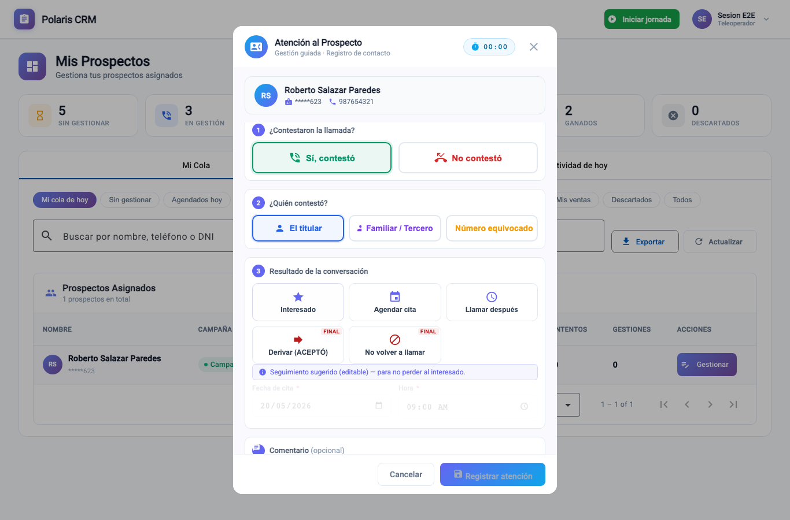

Igual, *Agendar cita* y *Llamar después* piden fecha y hora:

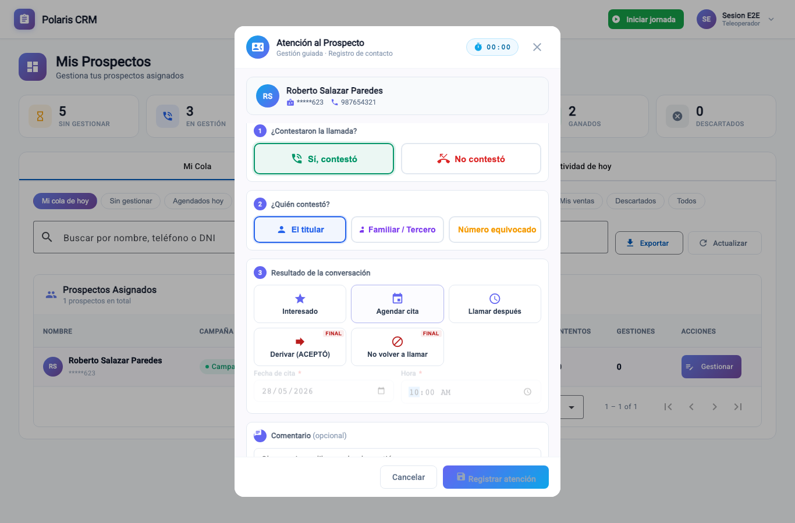

---

## 5. Enviar WhatsApp al prospecto

**El problema:** mandar la info por WhatsApp a mano es lento y el mensaje sale distinto cada vez.
**Cómo le ayuda:** tras un contacto efectivo **no negativo** (Interesado / Agendar / Llamar después / Derivar), aparece un panel para enviar el mensaje del convenio **ya prellenado** con el nombre del cliente y su nombre de asesor.

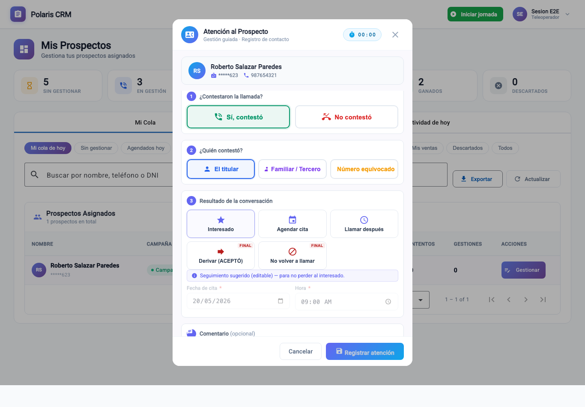

- **Abrir WhatsApp:** abre el chat con el número del prospecto y el texto listo. Solo revise y envíe.
- Puede **editar el texto** antes de enviar.
- **Descargar mi tarjeta:** baja su tarjeta de presentación para adjuntarla como segundo mensaje (WhatsApp no permite adjuntar imágenes por enlace; por eso va aparte). Si no aparece el botón, pídale a su administrador que cargue su tarjeta.

Es **opcional** y no interrumpe el registro de la atención.

---

## 6. Comentario y registro

Agregue un **comentario** (opcional) y presione **Registrar atención**: se guarda el resultado, se detiene el cronómetro y el caso se actualiza. Si cierra sin registrar, no se guarda el resultado.

---

## 7. Mi actividad

**Cómo le ayuda:** vea su propio avance del día (total de atenciones, resumen por resultado, lista de gestiones) sin depender de nadie.

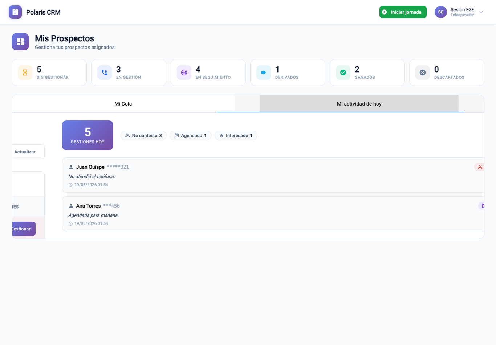

---

## 8. Resumen rápido

1. Ingrese — su jornada se inicia sola.
2. Abra un prospecto → arranca el cronómetro; revise el historial.
3. **Paso 0 SBS** (APTO sigue / OBSERVADO reprograma).
4. ¿Contestó? → ¿Quién? → **Resultado**.
5. **Interesado / Agendar / Llamar después** quedan con fecha → no se pierden.
6. Si aceptó → **Derivar (ACEPTÓ)** (la venta queda a su nombre).
7. Si corresponde, **Enviar WhatsApp** (texto listo + su tarjeta).
8. Comentario → **Registrar atención**. Revise **Mi actividad**.

---

*Fin del Manual del Colaborador.*
